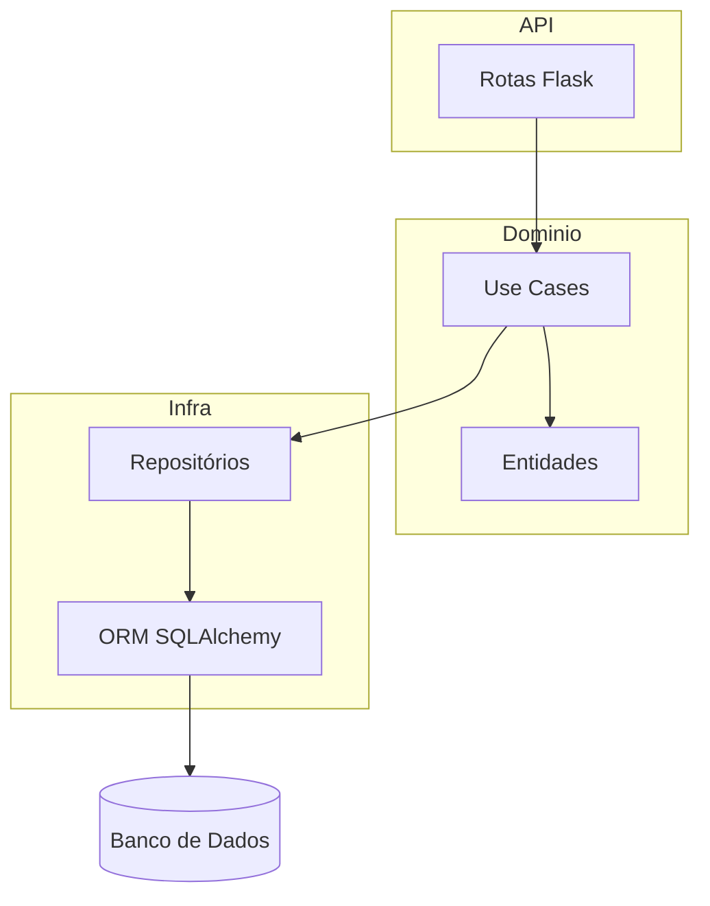
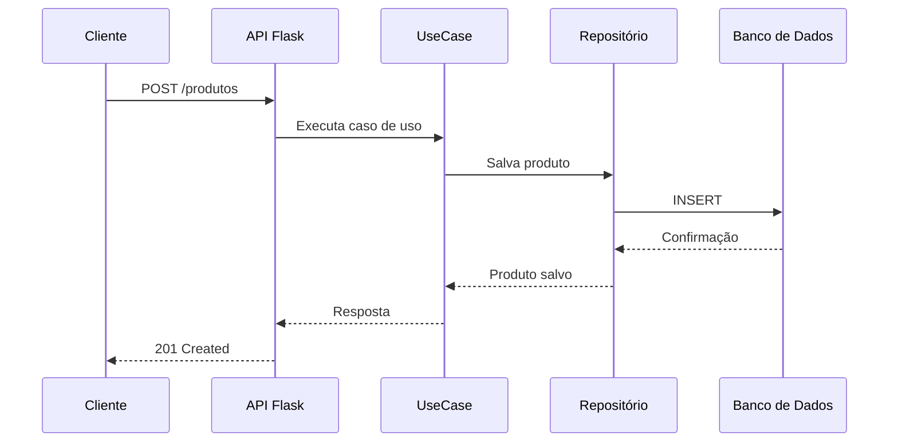

# Arquitetura do Sistema

## Visão Geral

O sistema segue uma arquitetura em camadas, separando responsabilidades entre API, domínio, persistência e infraestrutura. Utiliza o padrão Clean Architecture para facilitar manutenção e testes.

- **Componentes:**
  - API Flask (camada de apresentação)
  - Casos de uso (domínio)
  - Repositórios (infra/persistência)
  - Banco de dados relacional (SQLite, adaptável)

## Diagrama de Componentes

## Diagrama de Sequência (Exemplo: Criação de Produto)

## Tecnologias e Justificativa
- **Flask + Flask-OpenAPI3:** Simplicidade, extensibilidade e documentação automática.
- **SQLAlchemy:** ORM robusto e flexível.
- **Pydantic:** Validação de dados e schemas.

## Requisitos Não Funcionais
- Segurança: Validação de entrada, CORS, autenticação futura (ToDo).
- Escalabilidade: Modularização, fácil deploy em containers.
- Tolerância a falhas: Tratamento de exceções, logs estruturados (ToDo).
