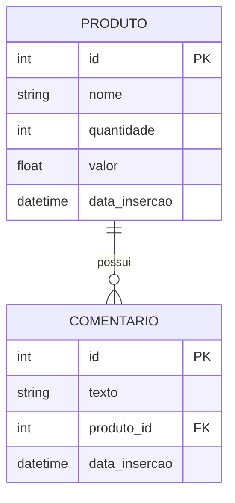

# Modelo de Dados

## Entidades Principais

- **Produto**: id, nome, quantidade, valor, data_insercao
- **Comentário**: id, texto, produto_id, data_insercao

## Diagrama ER (simplificado)

## Regras de Negócio
- Produto deve ter nome único.
- Quantidade deve ser >= 0.
- Comentário só pode ser adicionado a produto existente.
