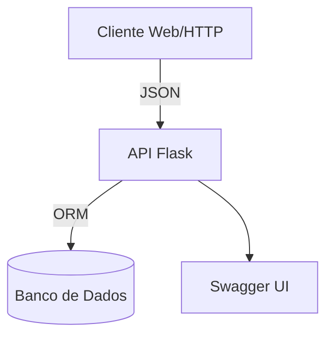

# Market List API

Bem-vindo à documentação oficial do projeto **Market List API**.

## Visão Geral

O Market List API é um backend para gerenciamento de listas de compras, produtos e comentários, com arquitetura modular, endpoints RESTful e documentação OpenAPI. O projeto é voltado para ensino de Engenharia de Software, com foco em boas práticas, testes e extensibilidade.

- **Principais componentes:**
  - API RESTful (Flask + Flask-OpenAPI3)
  - Modelos de domínio (produtos, comentários)
  - Camada de persistência (SQLAlchemy)
  - Documentação automatizada (Swagger/OpenAPI)
- **Tecnologias:** Python 3.12, Flask, Flask-OpenAPI3, SQLAlchemy, Pydantic
- **Status:** Em desenvolvimento

## Documentação

- [Arquitetura](architecture.md)
- [Modelo de Dados](data_model.md)
- [Referência da API](api_reference.md)
- [Decisões de Design](design_decisions.md)
- [Setup e Deploy](setup_and_deploy.md)
- [Testes](testing.md)
- [Contribuição](contributing.md)
- [Changelog](changelog.md)
